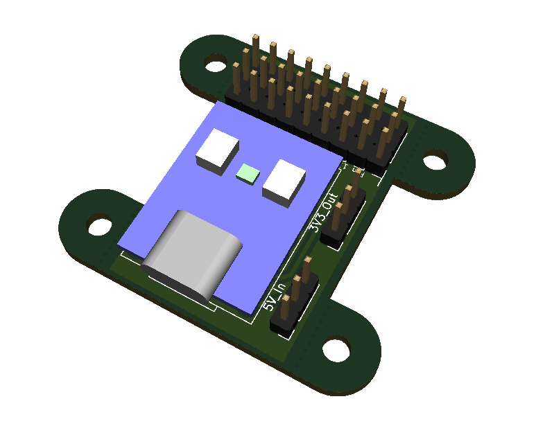

# ROS Sync Node Hardware

Breaks out a [Waveshare RP2040-Zero](https://www.waveshare.com/rp2040-zero.htm) with 0.1" header pins for use as a ROS-enabled hardware sync node.

<p align="center">
  
</p>

# Requirements
## KiCAD Files
Make sure to clone recursively so that you have the required libraries

```
git clone git@github.com:AndersonRayner/ros_sync_node_hw.git --recursive
```

Everything runs using kicad so you'll need that too.

## Arduino
### Add the Board Definition
Support in Arduino for the RP2040-Zero requires adding the board definition to the Boards Manager.
Add the URL
```
https://github.com/earlephilhower/arduino-pico/releases/download/global/package_rp2040_index.json
```
to `File > Preferences > Additional Boards Manager URLs`.

### Install the Toolchain
Open up the boards manager `Tools > Board > Boards Manager` and install `Raspberry Pi Pico/RP2040` by Earle F. Philhower, III.

### Compile Software
The software designed for this board to allow it to act as a ROS sync node is available at [ros_sync_node](https://github.com/AndersonRayner/ros_sync_node).
Compile and upload it as `Tools > Board > Raspberry Pi RP2040 Boards > Raspberry Pi Pico`.
